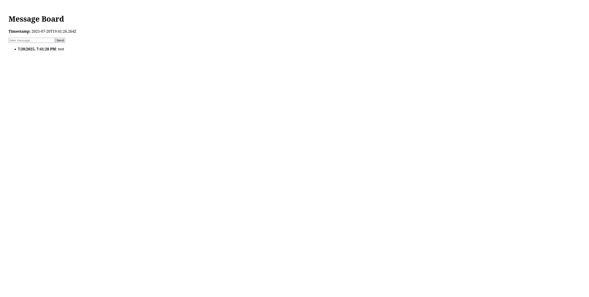

# k8s-training-app

## Prerequites
- Node.js
- npm
- PostgreSQL

## Project installation

### Step 1: DB
Create the database using the following name "messages". Then create the table using the following command:

```
CREATE TABLE messages (
  id SERIAL PRIMARY KEY,
  content TEXT NOT NULL,
  created_at TIMESTAMP DEFAULT CURRENT_TIMESTAMP
);
```

***And do not forget to add the password in message-api > db.js at line 7.***

### Step 2: Install message-api
Go to the ***message-api*** folder and install all dependencies:

```
cd message-api
npm install
```

### Step 3: timestamp-service
Go to the ***timestamp-service*** folder and install all dependencies:

```
cd ../timestamp-service
npm install
```

### Step 4: frontend
Go to the ***frontend*** folder and install all dependencies:

```
cd ../frontend
npm install
```

### Step 5: Run the project

Open three terminals from the root of the project and in each cli:

#### Terminal 1:
```
cd message-api
node index.js
```

#### Terminal 2:
```
cd timestamp-service
node index.js
```

#### Terminal 3:
```
cd frontend
npm run dev
```

The app is accessible via http://localhost:3000/.

